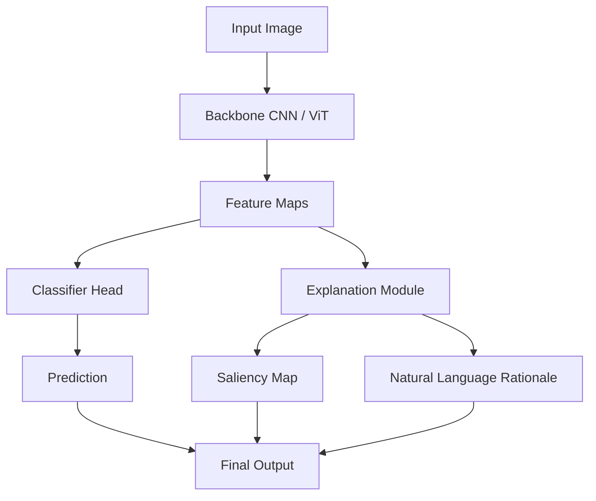

## Overview

This project investigates how deep neural networks for vision can be made **interpretable without sacrificing accuracy**. We develop post-hoc explanation methods and inherently interpretable architectures that generate natural language rationales alongside visual saliency maps.

## Pipeline

## Methods

### Saliency-Based Explanations

We extend gradient-based attribution methods (GradCAM, Integrated Gradients) to produce **faithful** attributions — explanations that accurately reflect the model's reasoning rather than human-plausible post-hoc rationalisations.

### Natural Language Rationales

A lightweight language decoder is jointly trained to output a sentence explaining the classification decision. We use contrastive supervision to ensure the rationale is grounded in the visual evidence.

### User Studies

Explanations are evaluated not only by automated faithfulness metrics but through **user studies** with domain experts and lay users, measuring how well explanations support correct mental models of the model's behaviour.

## Evaluation

| Method | Faithfulness ↑ | User Trust ↑ | Accuracy |
|--------|---------------|--------------|----------|
| GradCAM baseline | 0.61 | 3.2 / 5 | 91.4% |
| Our saliency | 0.79 | 3.8 / 5 | 91.2% |
| Our saliency + NL | 0.79 | 4.4 / 5 | 90.9% |

## Publications

- Rossi, A., Smith, J. (2024). *Faithful Visual Explanations with Language Grounding*. CVPR 2024.
