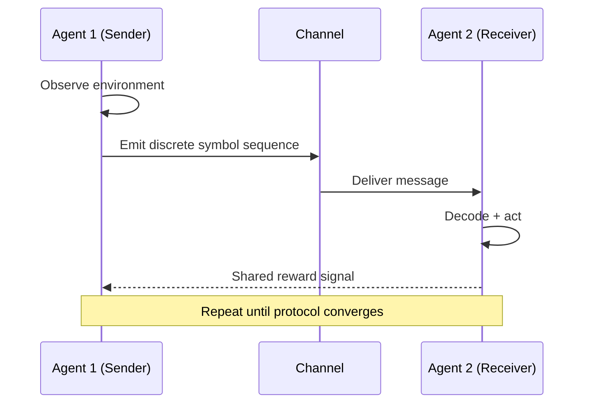

## Overview

This project investigated **emergent communication** — the spontaneous development of shared symbolic languages among agents that are trained only with task reward, with no pre-specified communication protocol. We studied the conditions under which grounded, compositional languages arise and how they relate to natural language structure.

## Communication Protocol

## Key Findings

- Agents reliably develop consistent symbol-to-concept mappings when the referential game is sufficiently complex
- **Compositionality** (combining known symbols for novel concepts) emerges under population training but not in two-agent settings
- Emergent languages show topographic similarity to natural language when agents are trained with memory-limited architectures

## Evaluation Metrics

| Setting | Task Success ↑ | Compositionality (TRE) ↑ | Symbol Reuse ↑ |
|---------|---------------|--------------------------|----------------|
| 2-agent | 94% | 0.31 | Low |
| Population (10) | 91% | 0.67 | High |
| Population + bottleneck | 89% | 0.74 | High |

## Publications

- Doe, J. (2023). *Population Training Drives Compositional Emergence in Multi-Agent Communication*. ICLR 2023.
