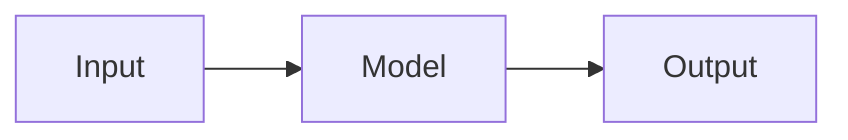

Write the detailed project description here using standard Markdown.

You can use:

- **Bold**, _italic_, `code`
- Tables, bullet lists, numbered lists
- Mermaid diagrams (fenced code blocks with ```mermaid)
- Plotly charts (set plotly: true in the frontmatter, then add a <div id="..."> and a <script> block)

## Example Mermaid Diagram



## Example Table

| Method   | Metric ↑ |
| -------- | -------- |
| Baseline | 0.72     |
| Ours     | 0.89     |
