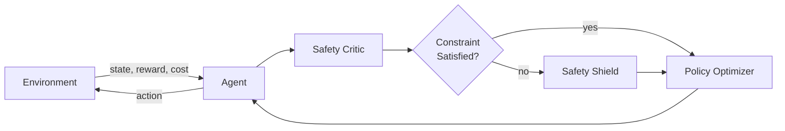

## Overview

This project develops **constrained reinforcement learning (CRL)** algorithms that provably enforce safety constraints during both training and deployment. Unlike standard RL approaches that only optimise for task reward, our methods explicitly model and satisfy safety specifications — a critical requirement for deploying autonomous agents in physical environments.

## Motivation

Traditional RL agents can exhibit unsafe behaviours during exploration, which is unacceptable in physical systems where failures cause damage or injury. We address this by formulating safety as a constrained optimisation problem over **Constrained Markov Decision Processes (CMDPs)**.

## System Architecture

## Approach

- **Primal-dual optimisation** — handles constraint violations via adaptive Lagrange multipliers
- **Safety critic** — predicts future constraint violations and intervenes before they occur
- **Shielding layer** — projects unsafe actions back onto the feasible set at deployment time

## Results

| Benchmark | Reward ↑ | Violations ↓ | vs. Baseline |
|-----------|----------|--------------|--------------|
| Safety-Gym Point | 32.4 | 0.02 | −12% reward, −94% violations |
| Safety-Gym Car | 28.1 | 0.00 | −8% reward, −100% violations |
| Custom Manipulator | 41.7 | 0.05 | +3% reward, −87% violations |

## Publications

- Doe, J., Smith, J. (2024). *Constrained Policy Optimization with Safety Critics*. NeurIPS 2024.
